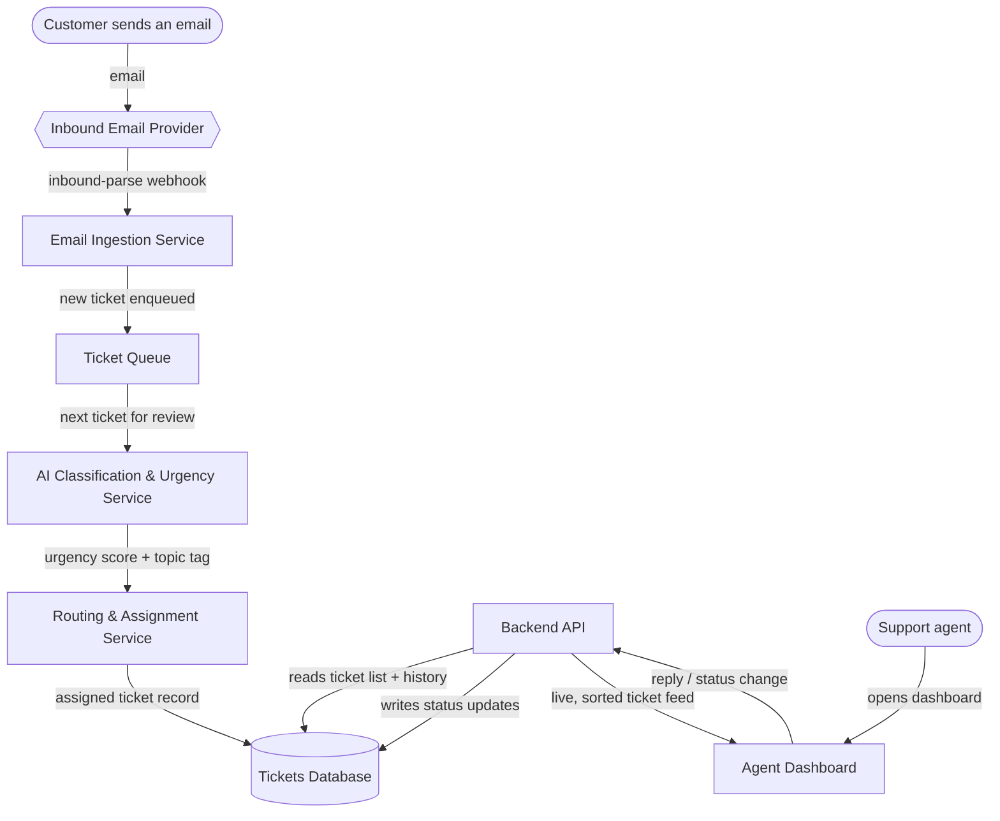

# Support Inbox Triage

## The Idea

> Build a tool for a small SaaS support team that receives bursty, unpredictable volumes of customer emails and currently triages them by hand in shared inbox software. Incoming tickets should land in a queue, get classified by an AI layer for urgency and topic, get matched to the right agent, and show up in a dashboard the team checks throughout the day, with a full history stored so nothing is lost between shifts. On day one it must correctly separate the handful of true emergencies from routine questions so nothing urgent sits unseen for hours.

## Assumptions

1. **Email arrives via an inbound-parse webhook from a transactional email provider** (e.g., a Postmark/SendGrid-style inbound parse), not IMAP polling. The idea says the team "receives" emails but doesn't name a channel; a webhook is the standard, low-latency way to get email into a system without polling delay — which matters given the "nothing urgent sits unseen for hours" requirement.
2. **"Matched to the right agent" means routing by topic specialty and current load**, not a fixed round-robin. The idea implies matching is meaningful (not arbitrary), so the routing step needs to know what each agent handles and how busy they are.
3. **This is single-tenant** — one support team, one shared queue. Nothing in the idea implies multiple customer organizations needing data isolation from each other.

## Components

| Component | What it does for this project | Words that required it |
|---|---|---|
| Inbound Email Provider | Receives the customer's email from the outside world and hands it to the system as structured data instead of raw mail-server traffic. | "receives ... customer emails" |
| Email Ingestion Service | Takes each incoming email and turns it into a ticket record the rest of the system can work with. | "receives bursty, unpredictable volumes of customer emails" |
| Ticket Queue | Holds new tickets in line so a sudden flood of emails doesn't overwhelm anything downstream — bursts get absorbed instead of dropped. | "bursty, unpredictable volumes" / "should land in a queue" |
| AI Classification & Urgency Service | Reads each ticket and decides how urgent it is and what it's about, so emergencies can be told apart from routine questions automatically. This is the component the day-one success sentence depends on. | "get classified by an AI layer for urgency and topic" / "must correctly separate the handful of true emergencies from routine questions" |
| Routing & Assignment Service | Takes the urgency and topic and decides which support agent should handle the ticket. | "get matched to the right agent" |
| Tickets Database | Keeps a permanent record of every ticket and what happened to it, so nothing is lost when one shift ends and the next begins. | "full history stored so nothing is lost between shifts" |
| Backend API | Connects the dashboard to the queue, the classifier's results, and the stored history so the team always sees current, accurate information. | "show up in a dashboard the team checks throughout the day" |
| Agent Dashboard | Gives the support team a live, always-current view of tickets — sorted so the true emergencies are impossible to miss. | "show up in a dashboard the team checks throughout the day" |

## How It Fits Together

## Data Flow Walkthrough

1. A customer emails support about a problem.
2. The Inbound Email Provider receives the raw email and fires a webhook at the Email Ingestion Service.
3. The Ingestion Service turns that webhook payload into a ticket record and pushes it onto the Ticket Queue — this is what protects the system when ten emails arrive in the same minute instead of one every ten minutes.
4. The AI Classification & Urgency Service pulls the next ticket off the queue, reads the email content, and assigns it an urgency level (for example: emergency, high, normal, low) and a topic tag.
5. The Routing & Assignment Service takes that urgency and topic, checks which agents handle that topic and who has capacity right now, and assigns the ticket to a specific agent. The full record — email, urgency, topic, assignee — is written to the Tickets Database.
6. The Backend API continuously reads from the Tickets Database and serves the current ticket list, sorted so emergencies surface at the top, to the Agent Dashboard.
7. A support agent opens the dashboard at any point in their shift, sees emergencies impossible to miss, and resolves or replies to a ticket. That action flows back through the API into the Database, so the full history is intact for whoever picks up the next shift.
